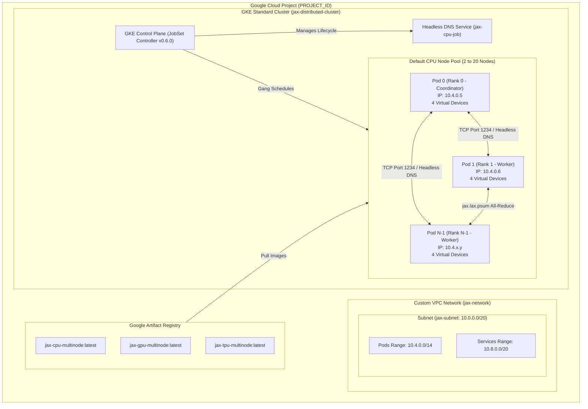
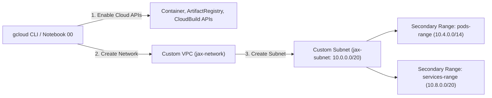
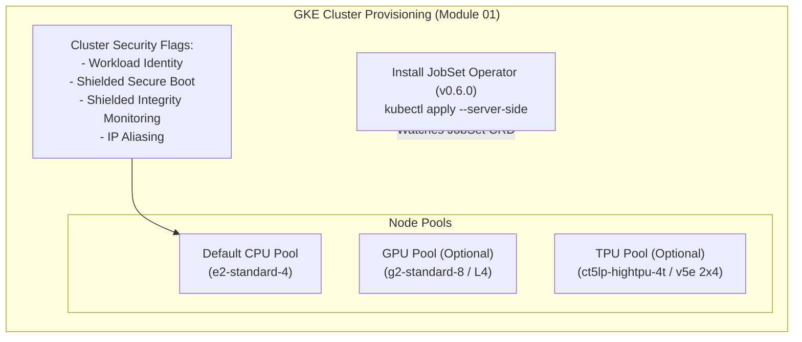
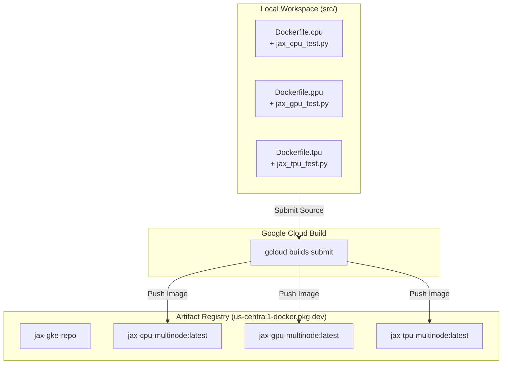
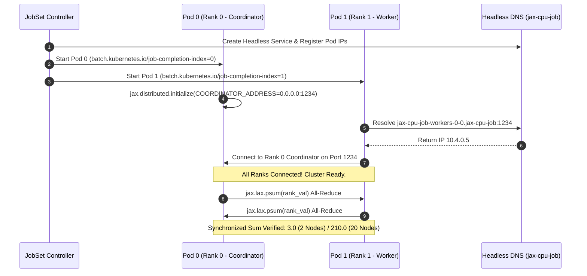
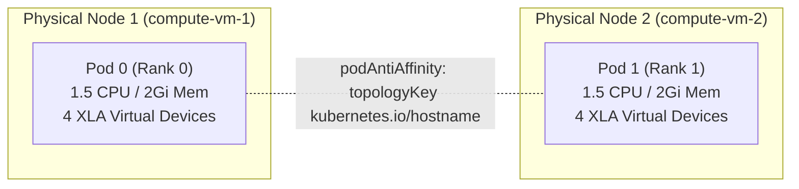
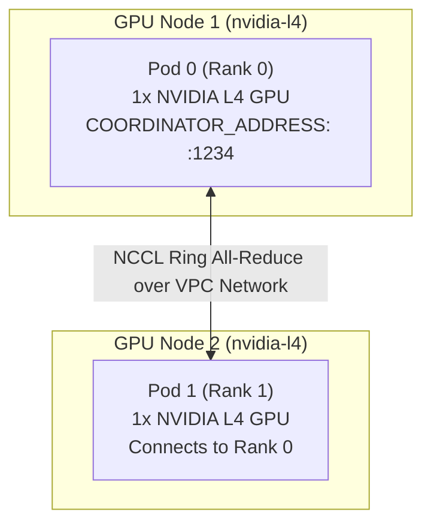
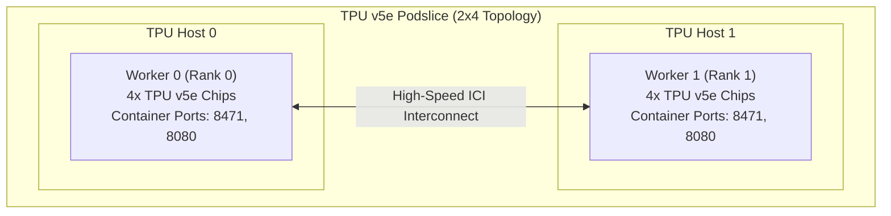
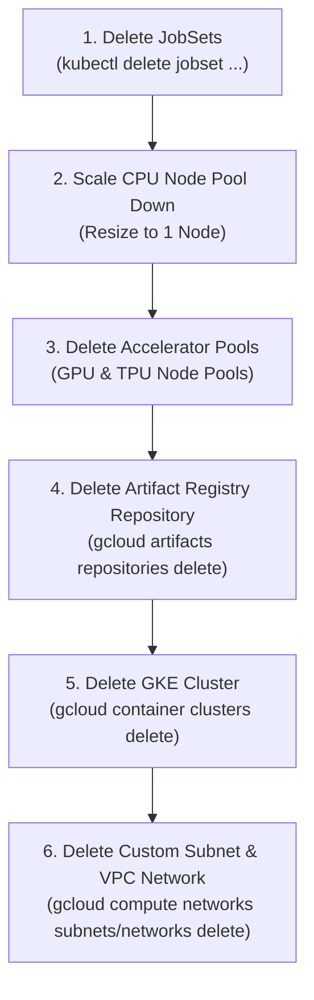

# JAX Multi-Node GKE Architecture & Lesson Breakdown

This document provides visual architecture diagrams and explanations for each module in the JAX Multi-Node training learning plan.

---

## 🏗️ High-Level System Architecture

---

## 📘 Module 00: Environment & Custom VPC Subnet Architecture

Module 00 provisions an isolated, enterprise-compliant VPC network with dedicated secondary IP ranges for Kubernetes Pods and Services.

---

## 📗 Module 01: GKE Cluster & JobSet Controller Setup

Module 01 creates a GKE Standard Cluster with Shielded VM security flags and installs the **Kubernetes JobSet Operator**.

---

## 📙 Module 02: Cloud Build & Artifact Registry Pipeline

Module 02 uses **Google Cloud Build** to compile container images serverlessly without requiring a local Docker daemon.

---

## 📕 Module 03: Multi-Node JAX CPU & 10x Scale-Up Architecture

Module 03 demonstrates true multiprocess multi-node JAX coordination without accelerator quota using `XLA_FLAGS="--xla_force_host_platform_device_count=4"`.

### 1. Headless DNS & Gang Scheduling Flow

### 2. Pod Anti-Affinity Topology

---

## 📘 Module 04: Multi-Node JAX GPU Training (NCCL Ring All-Reduce)

Module 04 orchestrates multi-node GPU training over NVIDIA NCCL interconnect.

---

## 📗 Module 05: Multi-Host TPU Slice Training (ICI Interconnect)

Module 05 deploys a TPU v5e multi-host slice (2x4 topology) connected via Inter-Chip Interconnect (ICI).

---

## 📙 Module 06: Cost Teardown & Resource Cleanup Flow

Module 06 cleans up all created GCP assets in strict reverse dependency order to prevent unexpected compute charges.

