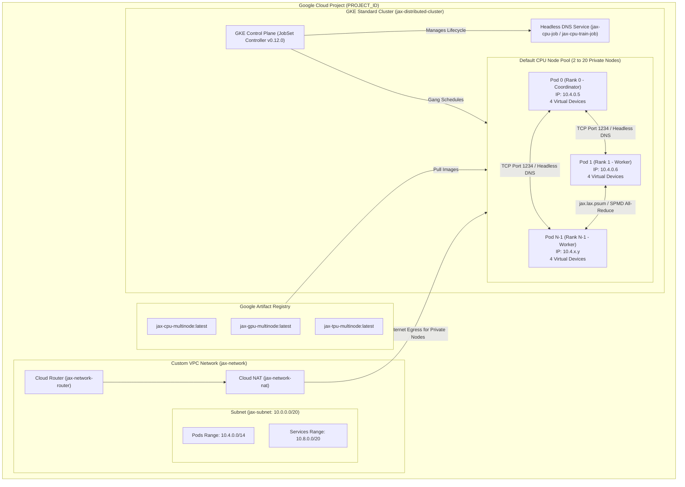
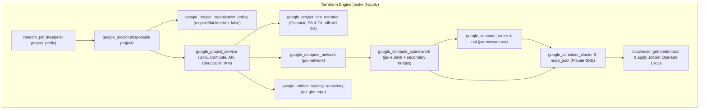
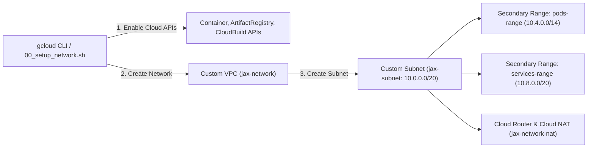
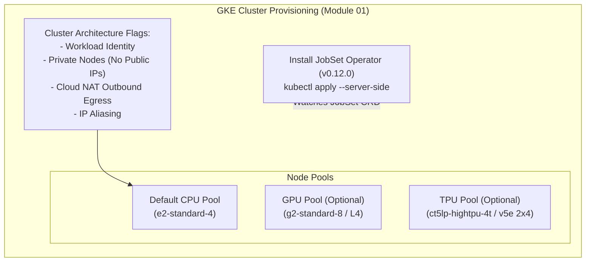
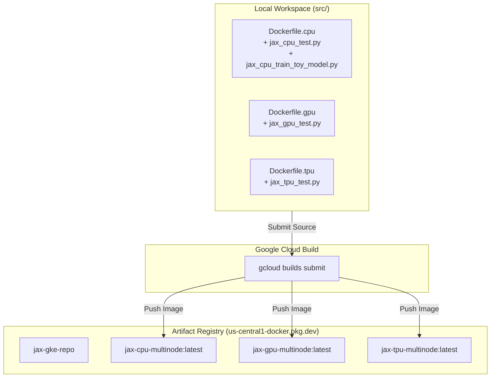
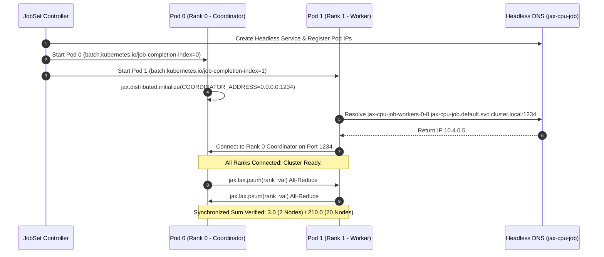
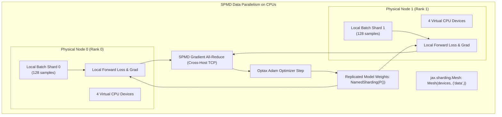
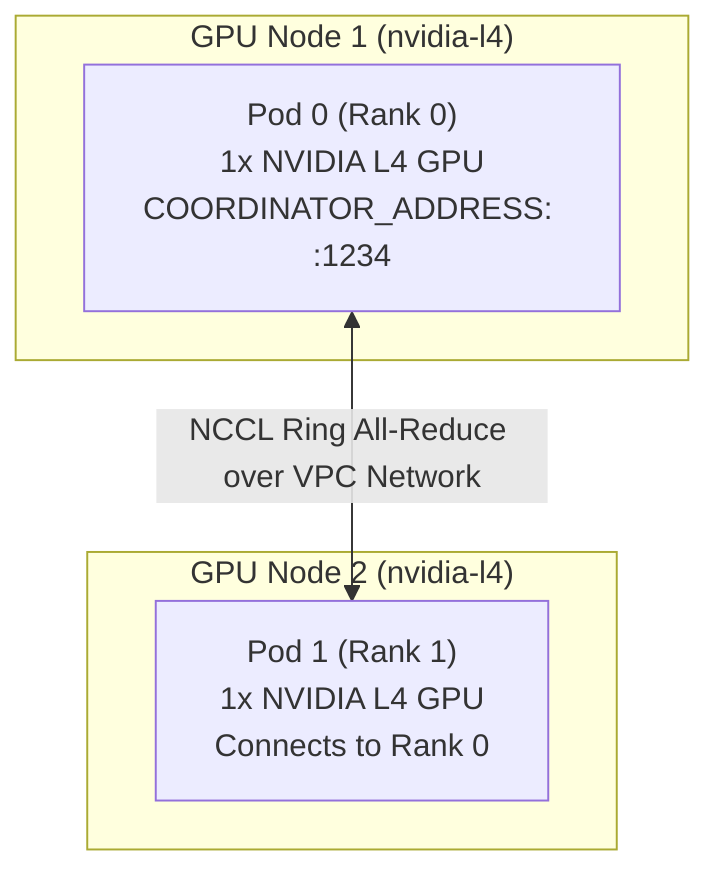
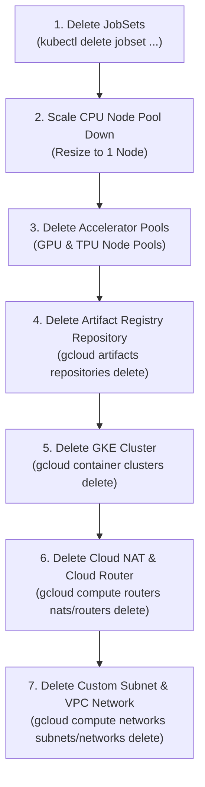

# JAX Multi-Node GKE Architecture & Lesson Breakdown

This document provides visual architecture diagrams and explanations for each module in the JAX Multi-Node training learning plan.

---

## 🏗️ High-Level System Architecture




---

## 🏛️ Infrastructure-as-Code Architecture (Terraform)

The `terraform/` directory manages the foundational cloud infrastructure declaratively:



---

## 📘 Module 00: Environment & Custom VPC Subnet Architecture

Module 00 provisions an isolated, enterprise-compliant VPC network with dedicated secondary IP ranges for Kubernetes Pods and Services, along with a Cloud Router and Cloud NAT for secure outbound egress from private nodes.



---

## 📗 Module 01: GKE Cluster & JobSet Controller Setup

Module 01 creates a GKE Standard Cluster with Private Nodes and Workload Identity, then installs the **Kubernetes JobSet Operator (v0.12.0)**.



---

## 📙 Module 02: Cloud Build & Artifact Registry Pipeline

Module 02 uses **Google Cloud Build** to compile container images serverlessly without requiring a local Docker daemon.



---

## 📕 Module 03: Multi-Node JAX CPU & 10x Scale-Up Architecture

Module 03 demonstrates true multiprocess multi-node JAX coordination without accelerator quota using `XLA_FLAGS="--xla_force_host_platform_device_count=4"`.

### 1. Headless DNS & Gang Scheduling Flow


---

## 🔬 Module 03b: Multi-Node CPU Toy Model Training Architecture

Module 03b executes distributed data-parallel (DDP) training of a 3-layer MLP classifier across CPU nodes using **Flax Linen** and **Optax Adam**.



---

## 📘 Module 04: Multi-Node JAX GPU Training (NCCL Ring All-Reduce)

Module 04 orchestrates multi-node GPU training over NVIDIA NCCL interconnect across dedicated `g2-standard-8` (NVIDIA L4) nodes.



---

## 📗 Module 05: Multi-Host TPU Slice Training (ICI Interconnect)

Module 05 deploys a TPU v5e multi-host slice (`2x4` topology, 8 total TPU chips) connected via Inter-Chip Interconnect (ICI).

```mermaid
graph TD
    subgraph TPUSlice["TPU v5e Podslice (2x4 Topology)"]
        subgraph TPUHost0["TPU Host 0 (ct5lp-hightpu-4t)"]
            TPUPod0["Worker 0 (Rank 0)\n4x TPU v5e Chips\nContainer Ports: 8471, 8080"]
        end

        subgraph TPUHost1["TPU Host 1 (ct5lp-hightpu-4t)"]
            TPUPod1["Worker 1 (Rank 1)\n4x TPU v5e Chips\nContainer Ports: 8471, 8080"]
        end
    end

    TPUPod0 <-->|High-Speed ICI Interconnect (Port 8471)| TPUPod1
```

---

## 📙 Module 06: Cost Teardown & Resource Cleanup Flow

Module 06 cleans up all created GCP assets in strict reverse dependency order to prevent unexpected compute charges (`make tf-destroy` or `./scripts/06_cleanup.sh`).


