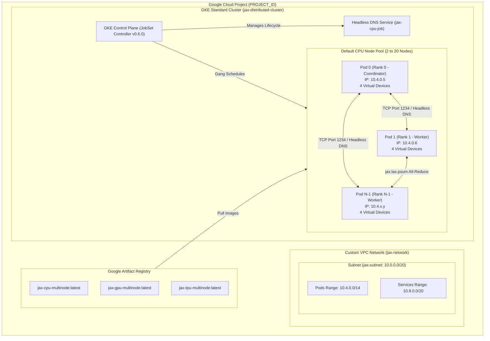

# JAX Multi-Node Training on GKE (CPU, GPU, and TPU)

Welcome to the production-ready learning plan and runbook for scaling **JAX multi-node distributed training** across **CPUs, GPUs, and Google Cloud TPUs** using **Google Kubernetes Engine (GKE)** and **Kubernetes JobSet**.

---

## 🌟 What's Included & Key Learnings

1. **Zero-Quota CPU Multi-Node & 10x Scale-Up**:
   - Because GPU/TPU quota can be difficult to acquire, the learning plan features a **100% accessible CPU multi-node path**.
   - Uses `XLA_FLAGS="--xla_force_host_platform_device_count=4"` to simulate 4 virtual devices per host while executing real inter-node multiprocess distribution across Kubernetes VM hosts.
   - Demonstrates **10x scale-up** from **2 Nodes (8 virtual devices)** to **20 Nodes (80 virtual devices)**.

2. **Mathematical `psum` Gradient All-Reduce Proof**:
   - Validates gradient all-reduce synchronization (`jax.lax.psum`).
   - For $N$ ranks with input rank value $i+1$, synchronized sum equals $\sum_{k=1}^N k = \frac{N(N+1)}{2}$.
   - **2 Ranks**: Synchronized sum = **`3.0`**.
   - **20 Ranks**: Synchronized sum = **`210.0`**.

3. **Kubernetes JobSet & Headless DNS**:
   - Deterministic headless DNS discovery: `COORDINATOR_ADDRESS="jax-cpu-job-workers-0-0.jax-cpu-job:1234"`.
   - Index tracking via `batch.kubernetes.io/job-completion-index`.
   - **Pod Anti-Affinity**: Forces worker pods onto distinct physical VM machines (`topologyKey: "kubernetes.io/hostname"`).
   - Atomic gang-scheduling and fault tolerance across worker nodes.

4. **GCP Networking & Security Policies**:
   - Custom VPC & Subnet with IP-Aliasing (`pods-range`, `services-range`).
   - Shielded VM & Secure Boot enabled (`--enable-shielded-nodes`, `--shielded-secure-boot`).

---

## 📐 System Architecture Overview

For module-by-module architecture diagrams, see **[`ARCHITECTURE.md`](ARCHITECTURE.md)**.




---

## 📁 Repository Structure

```
.
├── config.env                      # Central environment variables (User customizable)
├── config.py                       # Python module to load config.env into all notebooks
├── README.md                       # Comprehensive guide and documentation
├── ARCHITECTURE.md                 # Detailed visual architecture diagrams for each module
├── assets/                         # Architecture diagram assets & images
│   └── jax_gke_architecture_diagram.jpg
├── notebooks/                      # 7-Module Progressive Notebook Series
│   ├── 00_config_and_setup.ipynb   # Module 00: VPC, Subnet & GCP API Setup
│   ├── 01_gke_cluster_setup.ipynb  # Module 01: GKE Cluster & Operator Setup
│   ├── 02_container_build.ipynb    # Module 02: Artifact Registry & Cloud Build (CPU/GPU/TPU)
│   ├── 03_jax_cpu_multinode.ipynb  # Module 03: CPU Multi-Node & 10x Scale-Up (Zero Quota)
│   ├── 04_jax_gpu_multinode.ipynb  # Module 04: GPU Multi-Node Training (Optional Accelerator)
│   ├── 05_jax_tpu_multinode.ipynb  # Module 05: TPU Multi-Host Slice Training (v5e 2x4 Slice)
│   └── 06_cleanup.ipynb            # Module 06: Complete Resource Teardown & Cost Cleanup
├── src/                            # JAX Distributed Scripts & Dockerfiles
│   ├── jax_cpu_test.py             # CPU multi-node JAX script with psum proof
│   ├── jax_gpu_test.py             # GPU multi-node JAX script with NCCL psum proof
│   ├── jax_tpu_test.py             # TPU multi-host JAX script with ICI psum proof
│   ├── Dockerfile.cpu              # JAX CPU container definition
│   ├── Dockerfile.gpu              # CUDA 12 + JAX GPU container definition
│   └── Dockerfile.tpu              # libtpu + JAX TPU container definition
└── manifests/                      # Kubernetes JobSet Manifests
    ├── jobset-cpu.yaml             # CPU multi-node JobSet manifest template
    ├── jobset-gpu.yaml             # GPU multi-node JobSet manifest template
    └── jobset-tpu.yaml             # TPU v5e multi-host slice JobSet manifest template
```

---

## ⚙️ Configurable Variables (`config.env`)

Edit `config.env` to set your GCP Project ID and settings:

```bash
PROJECT_ID="[ENTER_PROJECT_ID]"
REGION="us-central1"
ZONE="us-central1-a"
CLUSTER_NAME="jax-distributed-cluster"
NETWORK_NAME="jax-network"
SUBNET_NAME="jax-subnet"
ARTIFACT_REGISTRY_REPO="jax-gke-repo"
CPU_IMAGE_NAME="jax-cpu-multinode"
GPU_IMAGE_NAME="jax-gpu-multinode"
TPU_IMAGE_NAME="jax-tpu-multinode"
IMAGE_TAG="latest"
```

---

## 🚀 Notebook Execution Flow

1. **[`00_config_and_setup.ipynb`](notebooks/00_config_and_setup.ipynb)**: Set project, activate APIs, create custom VPC subnet with IP aliasing.
2. **[`01_gke_cluster_setup.ipynb`](notebooks/01_gke_cluster_setup.ipynb)**: Create GKE cluster with Shielded VMs & install JobSet operator.
3. **[`02_container_build.ipynb`](notebooks/02_container_build.ipynb)**: Build CPU, GPU, and TPU JAX containers via Google Cloud Build.
4. **[`03_jax_cpu_multinode.ipynb`](notebooks/03_jax_cpu_multinode.ipynb)**: Launch 2-Node CPU multi-node job (Expected sum = `3.0`), scale GKE cluster to 20 nodes, launch 20-Node JobSet (Expected sum = `210.0`).
5. **[`04_jax_gpu_multinode.ipynb`](notebooks/04_jax_gpu_multinode.ipynb)**: Launch GPU multi-node training (If GPU quota available).
6. **[`05_jax_tpu_multinode.ipynb`](notebooks/05_jax_tpu_multinode.ipynb)**: Launch TPU v5e 2x4 slice training (If TPU quota available).
7. **[`06_cleanup.ipynb`](notebooks/06_cleanup.ipynb)**: Tear down JobSets, scale cluster down, and delete GCP resources.

---

## Questions 
Contact -> abrahamgomez@google.com