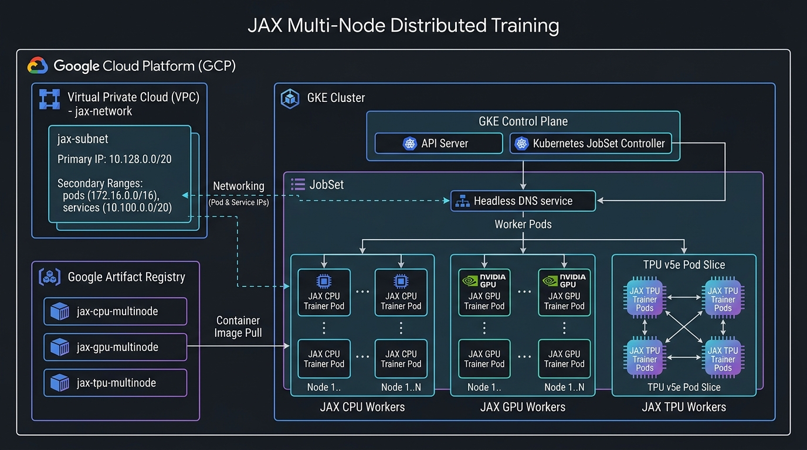

# JAX Multi-Node Training on GKE (CPU, GPU, and TPU)

Welcome to the production-ready learning plan and runbook for scaling **JAX multi-node distributed training** across **CPUs, GPUs, and Google Cloud TPUs** using **Google Kubernetes Engine (GKE)** and **Kubernetes JobSet**.

---

## 🌟 What's Included & Key Learnings

1. **Zero-Quota CPU Multi-Node & 10x Scale-Up**:
   - Because GPU/TPU quota can be difficult to acquire, the learning plan features a **100% accessible CPU multi-node path**.
   - Uses `XLA_FLAGS="--xla_force_host_platform_device_count=4"` to simulate 4 virtual devices per host while executing real inter-node multiprocess distribution across Kubernetes VM hosts.
   - Demonstrates **10x scale-up** from **2 Nodes (8 virtual devices)** to **20 Nodes (80 virtual devices)**.

2. **Mathematical `psum` Gradient All-Reduce Proof**:
   - Validates gradient all-reduce synchronization (`jax.lax.psum`).
   - For $N$ ranks with input rank value $i+1$, synchronized sum equals $\sum_{k=1}^N k = \frac{N(N+1)}{2}$.
   - **2 Ranks**: Synchronized sum = **`3.0`**.
   - **20 Ranks**: Synchronized sum = **`210.0`**.

3. **Kubernetes JobSet & Headless DNS**:
   - Deterministic headless DNS discovery: `COORDINATOR_ADDRESS="jax-cpu-job-workers-0-0.jax-cpu-job:1234"`.
   - Index tracking via `batch.kubernetes.io/job-completion-index`.
   - **Pod Anti-Affinity**: Forces worker pods onto distinct physical VM machines (`topologyKey: "kubernetes.io/hostname"`).
   - Atomic gang-scheduling and fault tolerance across worker nodes.

4. **GCP Networking & Security Policies**:
   - Custom VPC & Subnet with IP-Aliasing (`pods-range`, `services-range`).
   - Shielded VM & Secure Boot enabled (`--enable-shielded-nodes`, `--shielded-secure-boot`).

---

## 📋 Prerequisites & GCP Account Setup

Before running the interactive notebooks or terminal scripts, ensure you have:

1. **Google Cloud Project & Billing**:
   - A GCP Project ID with active billing enabled.
2. **Required IAM Permissions**:
   - `Kubernetes Engine Admin` (`roles/container.admin`)
   - `Artifact Registry Administrator` (`roles/artifactregistry.admin`)
   - `Cloud Build Editor` (`roles/cloudbuild.builds.editor`)
   - `Compute Network Admin` (`roles/compute.networkAdmin`)
   - `Storage Admin` (`roles/storage.admin`)
3. **Authentication**:
   - **Google Colab**: Authenticate via `from google.colab import auth; auth.authenticate_user()` (included in Module 00).
   - **Local Terminal**: Run `gcloud auth login` and `gcloud auth application-default login`.

---

## 📐 System Architecture Overview

For module-by-module architecture diagrams, see **[`ARCHITECTURE.md`](ARCHITECTURE.md)**.



---

## 🚀 Interactive Notebook Series (Open in Colab)

| Module | Notebook Title | Google Colab Link |
| :--- | :--- | :--- |
| **Module 00** | Environment & Custom VPC Setup | [](https://colab.research.google.com/github/goabego/Travolta_Multinode_Training/blob/main/notebooks/00_config_and_setup.ipynb) |
| **Module 01** | GKE Standard Cluster & Operator Setup | [](https://colab.research.google.com/github/goabego/Travolta_Multinode_Training/blob/main/notebooks/01_gke_cluster_setup.ipynb) |
| **Module 02** | Container Build & Artifact Registry | [](https://colab.research.google.com/github/goabego/Travolta_Multinode_Training/blob/main/notebooks/02_container_build.ipynb) |
| **Module 03** | CPU Multi-Node & 10x Scale-Up | [](https://colab.research.google.com/github/goabego/Travolta_Multinode_Training/blob/main/notebooks/03_jax_cpu_multinode.ipynb) |
| **Module 04** | GPU Multi-Node Training | [](https://colab.research.google.com/github/goabego/Travolta_Multinode_Training/blob/main/notebooks/04_jax_gpu_multinode.ipynb) |
| **Module 05** | TPU Multi-Host Slice Training | [](https://colab.research.google.com/github/goabego/Travolta_Multinode_Training/blob/main/notebooks/05_jax_tpu_multinode.ipynb) |
| **Module 06** | Complete Resource Teardown | [](https://colab.research.google.com/github/goabego/Travolta_Multinode_Training/blob/main/notebooks/06_cleanup.ipynb) |

---

## 🖥️ Running via Terminal / CLI (Without Notebooks)

You can run the entire workflow directly from your command-line terminal using the provided shell scripts in `scripts/`:

### 1. Configure your GCP Project
Edit `config.env` and set your `PROJECT_ID`:
```bash
PROJECT_ID="your-gcp-project-id"
```

### 2. Execute Shell Scripts & Deploy Workloads

```bash
# Step 00: Enable GCP APIs & Provision Custom VPC Network
./scripts/00_setup_network.sh

# Step 01: Create GKE Cluster & Install JobSet Operator
./scripts/01_create_cluster.sh

# Step 02: Build JAX Container Image via Cloud Build
./scripts/02_build_image.sh

# Step 03a: Render & Deploy CPU Multi-Node Training Job (Zero Quota)
./scripts/03_run_cpu_multinode.sh

# Step 03b: Deploy GPU Multi-Node Training Job (NVIDIA L4 / GPU Node Pool)
# Render image in manifests/jobset-gpu.yaml and apply:
sed "s|LOCATION-docker.pkg.dev/PROJECT_ID/ARTIFACT_REGISTRY_REPO/GPU_IMAGE_NAME:IMAGE_TAG|${REGION}-docker.pkg.dev/${PROJECT_ID}/${ARTIFACT_REGISTRY_REPO}/${GPU_IMAGE_NAME}:${IMAGE_TAG}|g" manifests/jobset-gpu.yaml | kubectl apply -f -

# Step 03c: Deploy TPU Multi-Host Slice Job (TPU v5e / 2x4 Topology)
# Render image in manifests/jobset-tpu.yaml and apply:
sed "s|LOCATION-docker.pkg.dev/PROJECT_ID/ARTIFACT_REGISTRY_REPO/TPU_IMAGE_NAME:IMAGE_TAG|${REGION}-docker.pkg.dev/${PROJECT_ID}/${ARTIFACT_REGISTRY_REPO}/${TPU_IMAGE_NAME}:${IMAGE_TAG}|g" manifests/jobset-tpu.yaml | kubectl apply -f -

# Step 06: Cleanup & Teardown All GCP Resources
./scripts/06_cleanup.sh
```

---

## 📁 Repository Structure

```
.
├── config.env                      # Central environment variables (User customizable)
├── config.py                       # Python module to load config.env into all notebooks
├── README.md                       # Comprehensive guide and documentation
├── ARCHITECTURE.md                 # Detailed visual architecture diagrams for each module
├── assets/                         # Architecture diagram assets & images
│   └── jax_gke_architecture_diagram.jpg
├── scripts/                        # CLI Bash Scripts (Run without Jupyter Notebooks)
│   ├── 00_setup_network.sh         # Step 00: VPC network & API setup script
│   ├── 01_create_cluster.sh        # Step 01: GKE cluster & JobSet operator script
│   ├── 02_build_image.sh           # Step 02: Container build via Cloud Build script
│   ├── 03_run_cpu_multinode.sh     # Step 03: CPU multi-node JobSet execution script
│   └── 06_cleanup.sh               # Step 06: Complete teardown & cleanup script
├── notebooks/                      # 7-Module Progressive Notebook Series
│   ├── 00_config_and_setup.ipynb   # Module 00: VPC, Subnet & GCP API Setup
│   ├── 01_gke_cluster_setup.ipynb  # Module 01: GKE Cluster & Operator Setup
│   ├── 02_container_build.ipynb    # Module 02: Artifact Registry & Cloud Build (CPU/GPU/TPU)
│   ├── 03_jax_cpu_multinode.ipynb  # Module 03: CPU Multi-Node & 10x Scale-Up (Zero Quota)
│   ├── 04_jax_gpu_multinode.ipynb  # Module 04: GPU Multi-Node Training (Optional Accelerator)
│   ├── 05_jax_tpu_multinode.ipynb  # Module 05: TPU Multi-Host Slice Training (v5e 2x4 Slice)
│   └── 06_cleanup.ipynb            # Module 06: Complete Resource Teardown & Cost Cleanup
├── src/                            # JAX Distributed Scripts & Dockerfiles
│   ├── jax_cpu_test.py             # CPU multi-node JAX script with psum proof
│   ├── jax_gpu_test.py             # GPU multi-node JAX script with NCCL psum proof
│   ├── jax_tpu_test.py             # TPU multi-host JAX script with ICI psum proof
│   ├── Dockerfile.cpu              # JAX CPU container definition
│   ├── Dockerfile.gpu              # CUDA 12 + JAX GPU container definition
│   └── Dockerfile.tpu              # libtpu + JAX TPU container definition
└── manifests/                      # Kubernetes JobSet Manifests
    ├── jobset-cpu.yaml             # CPU multi-node JobSet manifest template
    ├── jobset-gpu.yaml             # GPU multi-node JobSet manifest template
    └── jobset-tpu.yaml             # TPU v5e multi-host slice JobSet manifest template
```

---

## ⚙️ Configurable Variables (`config.env`)

Edit `config.env` to set your GCP Project ID and settings:

```bash
PROJECT_ID="[ENTER_PROJECT_ID]"
REGION="us-central1"
ZONE="us-central1-a"
CLUSTER_NAME="jax-distributed-cluster"
NETWORK_NAME="jax-network"
SUBNET_NAME="jax-subnet"
ARTIFACT_REGISTRY_REPO="jax-gke-repo"
CPU_IMAGE_NAME="jax-cpu-multinode"
GPU_IMAGE_NAME="jax-gpu-multinode"
TPU_IMAGE_NAME="jax-tpu-multinode"
IMAGE_TAG="latest"
```

---

## 🔗 Reference Assets & AI Hypercomputer Resources

For further reference, advanced benchmarks, and official GCP AI Hypercomputer infrastructure guides, explore the following resources:

1. **[Travolta JAX Multi-Node Training Repository](https://github.com/goabego/Travolta_Multinode_Training)**:
   - **What it Provides**: The core hands-on learning repository containing a progressive 7-module Jupyter notebook series, automated CLI shell scripts, Docker container definitions, and Kubernetes JobSet manifests for scaling distributed JAX workloads across CPUs, GPUs, and TPUs on GKE.

2. **[Google Cloud AI Hypercomputer GPU Recipes](https://github.com/AI-Hypercomputer/gpu-recipes)**:
   - **What it Provides**: Official Google Cloud repository featuring benchmarked recipes, deployment patterns, and performance optimization guides for training and serving large language models (LLMs) and generative AI workloads using NVIDIA GPUs on GCP.

3. **[Custom AI-Optimized GKE Clusters with A4X Max Documentation](https://docs.cloud.google.com/ai-hypercomputer/docs/create/gke-ai-hypercompute-custom-a4x-max)**:
   - **What it Provides**: Step-by-step Google Cloud guide for creating custom AI-optimized GKE clusters using high-performance A4X Max instances (`a4x-maxgpu-4g-metal`) paired with GPUDirect RDMA for low-latency multi-node GPU communication.

4. **[Creating Compute Engine A4X Max Instances Documentation](https://docs.cloud.google.com/ai-hypercomputer/docs/create/create-a4xmax-instance)**:
   - **What it Provides**: Detailed Google Cloud documentation on provisioning standalone A4X Max VM instances on Compute Engine, covering placement policies, GPU driver installation, and custom hardware configurations.

---

## Questions 
Contact -> abrahamgomez@google.com