# JAX Multi-Node Training on GKE (CPU, GPU, and TPU)

Welcome to the production-ready learning plan, infrastructure-as-code (IaC), and runbook for scaling **JAX multi-node distributed training** across **CPUs, GPUs, and Google Cloud TPUs** using **Google Kubernetes Engine (GKE)** and **Kubernetes JobSet**.

---

## 🌟 What's Included & Key Learnings

1. **Zero-Quota CPU Multi-Node & 10x Scale-Up**:
   - Features a **100% accessible CPU multi-node path** requiring zero GPU/TPU quota.
   - Uses `XLA_FLAGS="--xla_force_host_platform_device_count=4"` to configure 4 virtual devices per host while executing real inter-node multiprocess distribution across Kubernetes VM hosts.
   - Demonstrates **10x scale-up** from **2 Nodes (8 virtual devices)** to **20 Nodes (80 virtual devices)**.

2. **Real Multi-Node Model Training on CPUs (Module 03b)**:
   - Trains a complete multi-class MLP neural network using **Flax Linen** and **Optax (Adam)**.
   - Implements SPMD Data Parallelism with `jax.sharding.Mesh` and `NamedSharding` across physical hosts.
   - Proves cross-node gradient all-reduce backpropagation with mathematical loss convergence (>70% loss reduction).

3. **Hardware Accelerator Support (GPU & TPU)**:
   - **GPU Multi-Node (NVIDIA L4)**: Multi-node GPU training across `g2-standard-8` nodes using NVIDIA NCCL inter-node all-reduce over GKE.
   - **TPU Multi-Host Slices (TPU v5e)**: Multi-host TPU slice training on `ct5lp-hightpu-4t` in `2x4` topology (8 total TPU chips) interconnecting hosts over high-speed Inter-Chip Interconnect (ICI).

4. **Mathematical `psum` Gradient All-Reduce Proof**:
   - Validates gradient all-reduce synchronization (`jax.lax.psum`).
   - For $N$ ranks with input rank value $i+1$, synchronized sum equals $\sum_{k=1}^N k = \frac{N(N+1)}{2}$.
   - **2 Ranks (CPU/GPU/TPU)**: Synchronized sum = **`3.0`**.
   - **20 Ranks (CPU 10x Scale-Up)**: Synchronized sum = **`210.0`**.

5. **Kubernetes JobSet & Headless DNS Discovery**:
   - Deterministic headless DNS discovery: `COORDINATOR_ADDRESS="<jobset-name>-workers-0-0.<subdomain>.default.svc.cluster.local:<port>"`.
   - Index tracking via `batch.kubernetes.io/job-completion-index`.
   - **Pod Anti-Affinity**: Forces worker pods onto distinct physical VM machines (`topologyKey: "kubernetes.io/hostname"`).
   - **JobSet v0.12.0+ Native DNS**: JobSet automatically provisions and manages the headless `Service` when `spec.network.subdomain` is declared.

6. **Two Execution Paths**:
   - **Path A (Terraform + Make)**: Modern declarative Infrastructure-as-Code. Creates disposable projects with prefix-pet-name keepers, handles org policy overrides, VPC, Cloud NAT, Artifact Registry, GKE cluster, and installs JobSet Operator in a single apply.
   - **Path B (Progressive Shell Scripts)**: Step-by-step educational runbook for understanding each GCP and Kubernetes command sequentially.

---

## 📋 Prerequisites & GCP Account Setup

Before running the workflow, ensure you have:

1. **Google Cloud SDK (`gcloud`)** and **`kubectl`** installed and authenticated:
   ```bash
   gcloud auth login
   gcloud auth application-default login
   ```
2. **Billing Account**: An active GCP Billing Account ID (e.g. `01C57A-D0DCD2-49BE8B`).
3. **Target Organization / Folder**:
   - **Folder ID** (Recommended for enterprise orgs): e.g. `folder_id = "123456789012"`.
   - **Org ID**: e.g. `org_id = "101096319108"`.

---

## 🛠️ Execution Pathways

You can execute this project via **Path A (Terraform + Make)** or **Path B (Standalone Shell Scripts)**.

```mermaid
flowchart TD
    subgraph PathA["Path A: Terraform + Makefile (Recommended)"]
        TF1["1. Configure terraform.tfvars\n(billing_account, org_id / folder_id)"]
        TF2["2. make tf-apply\n(Provisions Project, VPC, NAT, AR, GKE & JobSet Operator)"]
        TF3["3. make sync-config\n(Syncs active PROJECT_ID into config.env)"]
        TF4["4. make 02-build-cpu\n(Builds container image via Cloud Build)"]
        TF5["5. make 03-run-cpu / make 03b-train-toy-model\n(Executes distributed tests)"]
        TF6["6. make tf-destroy\n(Full automated teardown)"]
        TF1 --> TF2 --> TF3 --> TF4 --> TF5 --> TF6
    end

    subgraph PathB["Path B: Progressive Shell Scripts (Manual)"]
        S1["1. Configure config.env\n(PROJECT_ID, REGION, ZONE)"]
        S2["2. ./scripts/00_setup_network.sh\n(VPC, Subnet, NAT, APIs, IAM)"]
        S3["3. ./scripts/01_create_cluster.sh\n(GKE Cluster & JobSet Operator)"]
        S4["4. ./scripts/02_build_image.sh cpu\n(Container build)"]
        S5["5. ./scripts/03_run_cpu_multinode.sh --all\n(All-reduce verification)"]
        S6["6. ./scripts/03b_run_cpu_model_training.sh\n(Toy model training)"]
        S7["7. ./scripts/06_cleanup.sh\n(Manual teardown)"]
        S1 --> S2 --> S3 --> S4 --> S5 --> S6 --> S7
    end
```



---

### 🅰️ Path A: Terraform + Makefile Workflow (Recommended)

#### 1. Configure Terraform
Navigate to `terraform/` and create your `terraform.tfvars`:
```bash
cd terraform
cp terraform.tfvars.example terraform.tfvars
```

Edit `terraform/terraform.tfvars`:
```hcl
project_prefix  = "travolta"
billing_account = "01C57A-D0DCD2-49BE8B"
org_id          = "101096319108"
# folder_id     = "YOUR_FOLDER_ID"  # Use if creating under a specific folder
region          = "us-central1"
zone            = "us-central1-a"
```

#### 2. Provision Infrastructure & Operators
```bash
# Initialize Terraform
make tf-init

# Plan & Provision Project, VPC, NAT, Artifact Registry, GKE Cluster, and JobSet Operator
make tf-apply

# Sync the generated project ID to config.env
make sync-config
```

#### 3. Build Container Images & Run Workloads
```bash
# Build the CPU JAX container image via Cloud Build
make 02-build-cpu

# Run Module 03: CPU Multi-Node All-Reduce Verification (Parts A & B)
make 03-run-cpu

# Run Module 03b: Distributed Toy Model Training (Flax + Optax)
make 03b-train-toy-model
```

#### 4. Optional Accelerator Training (GPU / TPU)
```bash
# Build GPU / TPU container images
make 02-build-gpu
make 02-build-tpu

# Run GPU multi-node training on NVIDIA L4 (NCCL)
make 04-run-gpu

# Run TPU multi-host slice training on TPU v5e (ICI)
make 05-run-tpu
```

#### 5. Teardown
```bash
make tf-destroy
```

---

### 🅱️ Path B: Standalone Shell Scripts Workflow

If you already have a target GCP project or wish to execute each bash script step-by-step:

#### 1. Configure `config.env`
Edit [`config.env`](config.env) with your GCP project ID:
```bash
PROJECT_ID="your-gcp-project-id"
REGION="us-central1"
ZONE="us-central1-a"
```

#### 2. Execute Progressive Shell Scripts

```bash
# Module 00: Enable GCP APIs, Provision Custom VPC Network & Cloud NAT
./scripts/00_setup_network.sh

# Module 01: Create GKE Standard Cluster & Install JobSet Operator
./scripts/01_create_cluster.sh

# Module 02: Build JAX Container Images via Google Cloud Build
./scripts/02_build_image.sh cpu

# Module 03: Run CPU Multi-Node All-Reduce & 10x Scale-Up Verification
./scripts/03_run_cpu_multinode.sh --all

# Module 03b: Run CPU Multi-Node Toy Model Training
./scripts/03b_run_cpu_model_training.sh

# Module 04: Multi-Node GPU Training (NVIDIA L4)
./scripts/04_run_gpu_multinode.sh

# Module 05: Multi-Host TPU Slice Training (TPU v5e 2x4 Topology)
./scripts/05_run_tpu_multinode.sh

# Module 06: Complete Resource Teardown
./scripts/06_cleanup.sh
```

---

## 📊 Module Summary & Command Reference

| Module | Script | Make Target | Description |
|---|---|---|---|
| **00** | [`scripts/00_setup_network.sh`](file:///usr/local/google/home/luissala/Projects/Travolta_Multinode_Training/scripts/00_setup_network.sh) | `make 00-setup-network` | Enables APIs, sets up custom VPC, subnet with IP-aliasing, Cloud Router, Cloud NAT, and SA IAM roles. |
| **01** | [`scripts/01_create_cluster.sh`](file:///usr/local/google/home/luissala/Projects/Travolta_Multinode_Training/scripts/01_create_cluster.sh) | `make 01-create-cluster` | Creates private GKE cluster with Workload Identity and installs JobSet Operator v0.12.0. |
| **02** | [`scripts/02_build_image.sh`](file:///usr/local/google/home/luissala/Projects/Travolta_Multinode_Training/scripts/02_build_image.sh) | `make 02-build-cpu` / `make 02-build-images` | Builds container images serverlessly using Google Cloud Build and pushes to Artifact Registry. |
| **03** | [`scripts/03_run_cpu_multinode.sh`](file:///usr/local/google/home/luissala/Projects/Travolta_Multinode_Training/scripts/03_run_cpu_multinode.sh) | `make 03-run-cpu` | Runs 2-node baseline (8 virtual devices, sum: 3.0) and 20-node scale-up (80 virtual devices, sum: 210.0). |
| **03b** | [`scripts/03b_run_cpu_model_training.sh`](file:///usr/local/google/home/luissala/Projects/Travolta_Multinode_Training/scripts/03b_run_cpu_model_training.sh) | `make 03b-train-toy-model` | Trains an MLP neural network across CPU nodes using Flax + Optax, verifying loss convergence. |
| **04** | [`scripts/04_run_gpu_multinode.sh`](file:///usr/local/google/home/luissala/Projects/Travolta_Multinode_Training/scripts/04_run_gpu_multinode.sh) | `make 04-run-gpu` | Provisions GPU node pool (`nvidia-l4`), deploys GPU JobSet, and verifies NCCL inter-node all-reduce. |
| **05** | [`scripts/05_run_tpu_multinode.sh`](file:///usr/local/google/home/luissala/Projects/Travolta_Multinode_Training/scripts/05_run_tpu_multinode.sh) | `make 05-run-tpu` | Provisions TPU node pool (`ct5lp-hightpu-4t`, `2x4` slice), deploys TPU JobSet, and validates ICI communication. |
| **06** | [`scripts/06_cleanup.sh`](file:///usr/local/google/home/luissala/Projects/Travolta_Multinode_Training/scripts/06_cleanup.sh) | `make 06-cleanup` / `make tf-destroy` | Tears down JobSets, cluster, Artifact Registry repositories, Cloud NAT, and VPC network. |

---

## 💡 Key Architectural Learnings from Live Testing

1. **Private Clusters Require Cloud NAT for Outbound Internet**:
   - Because worker nodes run on private IPs (`--enable-private-nodes`), they cannot communicate directly with the public internet.
   - A Cloud Router and Cloud NAT gateway (`jax-network-nat`) must be attached to the VPC subnet to allow nodes to pull external packages and base images without requiring public IPs.

2. **JobSet v0.12.0+ Automatic Headless DNS**:
   - When specifying `subdomain: <job-name>` under `spec.network`, the Kubernetes JobSet controller automatically instantiates and manages the headless Service. Manual `kind: Service` definitions in manifests are redundant and cause naming conflicts.

3. **Cloud Build IAM Service Account Role Requirements**:
   - The default Compute Engine service account (`[PROJECT_NUMBER]-compute@developer.gserviceaccount.com`) used by Cloud Build requires `roles/storage.objectViewer` to download the uploaded source tarball from the Cloud Build GCS staging bucket and `roles/logging.logWriter` to stream build logs.

4. **Deterministic Coordinator Discovery**:
   - Distributed JAX on Kubernetes requires worker rank 0 to bind to `0.0.0.0:<port>` while all worker ranks connect to `COORDINATOR_ADDRESS="<coordinator-pod-fqdn>:<port>"`.

5. **Prefix-Pet-Name Keepers in Terraform**:
   - `random_pet` with a `keepers = { project_prefix = var.project_prefix }` block ensures stable project naming across iterative applies while allowing intentional rebuilds when the prefix changes.

6. **Scoped Project-Level Organization Policy Overrides**:
   - Rather than requiring org-wide administrator privileges, `constraints/compute.requireShieldedVm` is overridden directly at the project level via `google_project_organization_policy`.

---

## 📁 Repository Structure

```
.
├── Makefile                        # Central Makefile with numbered targets matching modules
├── config.env                      # Central environment variables (User customizable)
├── config.py                       # Python module to inspect config.env variables
├── README.md                       # Comprehensive guide, learnings, and dual-path runbook
├── ARCHITECTURE.md                 # Detailed visual architecture diagrams for each module
├── draft-docs.md                   # Quick CPU testing reference
├── assets/                         # Architecture diagram assets & images
│   └── jax_gke_architecture_diagram.jpg
├── terraform/                      # Declarative Terraform Infrastructure (Path A)
│   ├── versions.tf                 # Provider configurations (Google, Random)
│   ├── variables.tf                # Central variables (Project, VPC, GKE, Pools)
│   ├── main.tf                     # Disposable project & org policy overrides
│   ├── services.tf                 # GCP API enablement
│   ├── iam.tf                      # Service account IAM bindings
│   ├── network.tf                  # VPC, Subnet, Cloud Router, Cloud NAT
│   ├── artifact_registry.tf        # Docker Artifact Registry repository
│   ├── gke.tf                      # GKE cluster, CPU/GPU/TPU node pools & JobSet setup
│   ├── outputs.tf                  # Project ID, endpoints, and credentials command
│   ├── terraform.tfvars.example    # Sample configuration template
│   └── README.md                   # Terraform module documentation
├── scripts/                        # Standalone CLI Bash Scripts (Path B)
│   ├── 00_setup_network.sh         # Step 00: VPC network, Cloud NAT & API setup script
│   ├── 01_create_cluster.sh        # Step 01: GKE cluster & JobSet operator script
│   ├── 02_build_image.sh           # Step 02: Container build via Cloud Build script
│   ├── 03_run_cpu_multinode.sh     # Step 03: CPU multi-node JobSet execution script
│   ├── 03b_run_cpu_model_training.sh # Step 03b: CPU multi-node toy model training script
│   ├── 04_run_gpu_multinode.sh     # Step 04: GPU multi-node JobSet execution script
│   ├── 05_run_tpu_multinode.sh     # Step 05: TPU multi-host slice JobSet execution script
│   └── 06_cleanup.sh               # Step 06: Complete teardown & cleanup script
├── src/                            # JAX Distributed Scripts & Dockerfiles
│   ├── jax_cpu_test.py             # CPU multi-node JAX script with psum proof
│   ├── jax_cpu_train_toy_model.py  # CPU multi-node toy model training with Flax + Optax
│   ├── jax_gpu_test.py             # GPU multi-node JAX script with NCCL psum proof
│   ├── jax_tpu_test.py             # TPU multi-host JAX script with ICI psum proof
│   ├── Dockerfile.cpu              # JAX CPU container definition
│   ├── Dockerfile.gpu              # CUDA 12 + JAX GPU container definition
│   └── Dockerfile.tpu              # libtpu + JAX TPU container definition
└── manifests/                      # Kubernetes JobSet Manifests
    ├── jobset-cpu.yaml             # CPU multi-node JobSet manifest template
    ├── jobset-cpu-training.yaml    # CPU toy model training JobSet manifest template
    ├── jobset-gpu.yaml             # GPU multi-node JobSet manifest template
    └── jobset-tpu.yaml             # TPU v5e multi-host slice JobSet manifest template
```

---

## 🔗 Reference Assets & AI Hypercomputer Resources

1. **[Travolta JAX Multi-Node Training Repository](https://github.com/goabego/Travolta_Multinode_Training)**
2. **[Google Cloud AI Hypercomputer GPU Recipes](https://github.com/AI-Hypercomputer/gpu-recipes)**
3. **[Custom AI-Optimized GKE Clusters with A4X Max Documentation](https://docs.cloud.google.com/ai-hypercomputer/docs/create/gke-ai-hypercompute-custom-a4x-max)**

---

## Questions
Contact -> abrahamgomez@google.com
